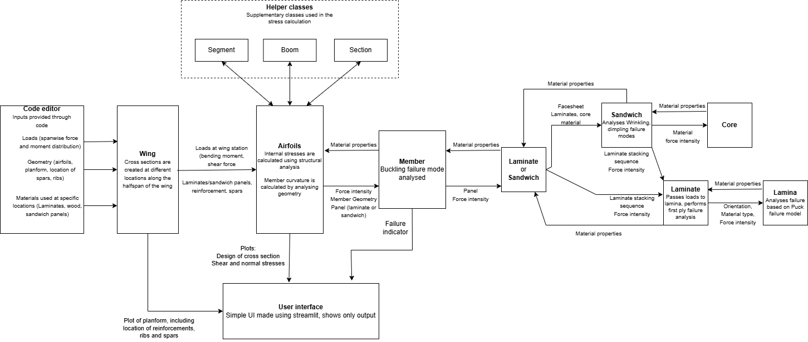

======================
Introduction
======================

This package has a set of tool which can be used for the design and analysis of composite
structures (DACS). It mostly offers 2 main functionalities:

Composite material analysis
------------------

Analyis of laminates, lamina, sandwiches, in failure modes of buckling, first ply failure, wrinkling and dimpling.

Wing analysis
------------------

The application of the composite material analysis methods on the design of a composite wing.

